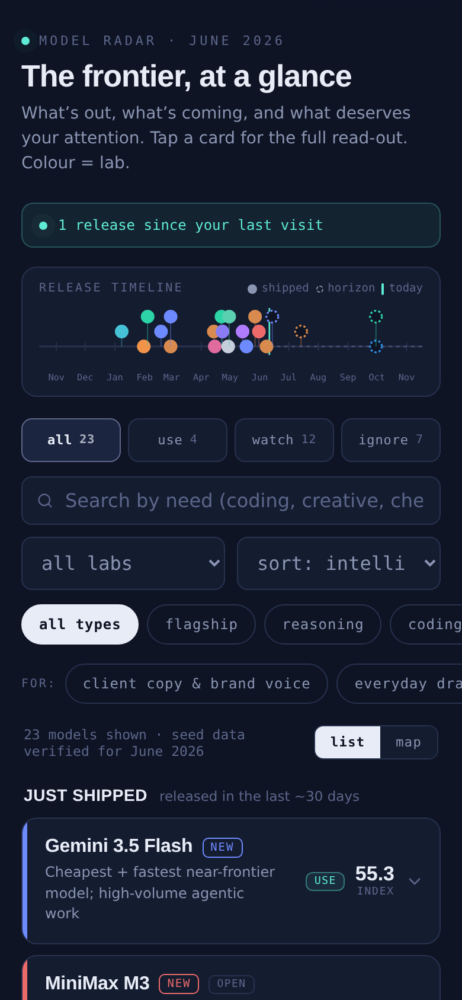

# Model Radar

The AI frontier at a glance — a curated tracker of closed flagships, open-weight
leaders, small/edge models, and what's on the horizon. Expandable cards with
specs, strengths vs watch-outs, pricing, and community sentiment.


## Screenshot



## Project Info

| Item | Details |
|---|---|
| Project Name | release |
| Repo | dariohudon/Release |
| Folder | /var/www/release |
| Domain | release.brightening.ca |
| Port | 3033 |
| PM2 Process | release |
| Tmux Session | release |
| Tmux Launcher | tmux-release |

## How it works

- **All data is static** in `lib/models/data.ts` (`LABS` + `MODELS`). No
  backend, no API keys, no network calls — by design. To update the catalog,
  edit that file and rebuild.
- **Verdict triage**: every model carries an editorial verdict — use / watch /
  ignore — shown as a pill on each card and as the primary filter. Edit
  verdicts in `lib/models/data.ts`.
- **Release timeline**: recent months behind a "today" marker, horizon items
  ahead as hollow dots; tap a dot to jump to its card.
- **Map view**: intelligence vs $/M scatter (list/map toggle). Sweet spot =
  top-left. Models without comparable figures are listed below the chart.
- **New since last visit**: returning visitors get a banner + card markers for
  anything released since their previous session (localStorage).
- **For-the-job picker**: chips like "client copy & brand voice" surface the
  top pick(s) for that job, best first (mappings in `JOBS` in the data file).
- **Lab pages**: `/labs/<id>` (e.g. `/labs/anthropic`) — evergreen profile,
  focus areas, official links, and that lab's tracked models. Linked from
  every card drawer.
- **Sections**: Just shipped / Live now / On the horizon (rumored items are
  honestly labelled as estimates).
- **Filtering**: text search, lab dropdown, type chips, verdict filter, sort
  by intelligence / newest / cheapest (price sort understands "~3" etc.).
- **Persistence**: last-used filters + view are kept in localStorage.
- **Styling**: design tokens as CSS custom properties in `app/radar.css`
  (dark navy palette, per-lab color rails). Space Grotesk / Inter /
  JetBrains Mono. No Tailwind.

## Data caveats

Seed data was verified against the web on June 11, 2026, but figures are
directional — open-weight benchmark numbers are often vendor-reported, and
horizon entries are cadence/rumor estimates, not announcements.

## Development

```bash
cd /var/www/release
npm run dev        # dev server on port 3033
npm run build      # production build
npm run type-check # TypeScript check
npm run lint       # ESLint
```

## Production (PM2)

```bash
pm2 start /var/www/release/ecosystem.config.js
pm2 restart release
```

Health check: `http://localhost:3033/api/health`

## History

This repo previously hosted Episode Radar (Sonarr + Plex tracker), then the
AI Release Radar feed (June 2026), before becoming Model Radar. Both earlier
apps are preserved in git history.
