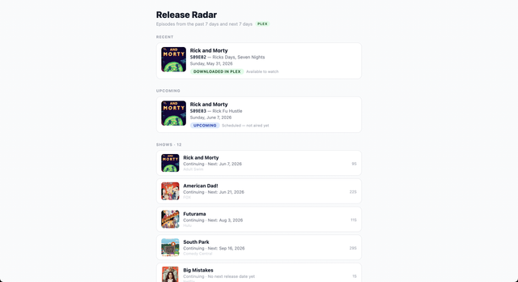

# Release Radar

Episode Radar for your Sonarr + Plex setup. Shows recent and upcoming episodes with download status, optionally confirmed against your Plex library.


## Screenshot



## Project Info

| Item | Details |
|---|---|
| Project Name | release |
| Repo | dariohudon/Release |
| Folder | /var/www/release |
| Domain | release.brightening.ca |
| Port | 3033 |
| PM2 Process | release |
| Tmux Session | release |
| Tmux Launcher | tmux-release |

## Data Sources

| Source | Role |
|---|---|
| **Sonarr** | Episode schedule, download status, poster artwork |
| **Plex** | Watchability confirmation (optional) |

## Environment Variables

Copy `.env.example` to `.env.local` and fill in values.

### Required

| Variable | Description |
|---|---|
| `SONARR_URL` | Sonarr base URL, e.g. `http://192.168.1.104:8989` |
| `SONARR_API_KEY` | Sonarr API key (Settings → General) |

### Optional — Plex

When set, episode cards show **Downloaded in Plex** vs **Downloaded, waiting for Plex**.

| Variable | Default | Description |
|---|---|---|
| `PLEX_URL` | — | Plex Media Server URL, e.g. `http://localhost:32400` |
| `PLEX_TOKEN` | — | Plex authentication token |
| `PLEX_TV_LIBRARY` | `TV Shows` | Name of your TV library in Plex |

## Episode Status Reference

| Status | Meaning |
|---|---|
| **Upcoming** | Air date in the future |
| **Downloaded in Plex** | Sonarr has file + Plex confirms availability |
| **Waiting for Plex** | Sonarr has file but not yet visible in Plex |
| **Downloaded** | Sonarr has file, Plex not configured |
| **Missing** | Aired but no file in Sonarr |

## Development

```bash
cd /var/www/release
npm run dev        # dev server on port 3033
npm run build      # production build
npm run type-check # TypeScript check
npm run lint       # ESLint
```

## Production (PM2)

```bash
pm2 start /var/www/release/ecosystem.config.js
pm2 restart release
```

## Health Check

```
http://localhost:3033/api/health
```

Reports Sonarr and Plex connectivity, versions, and library status.

## MVP Limitations

- No authentication
- No database
- No notifications
- No qBittorrent or Prowlarr integration
- No show detail pages
- Calendar window: 7 days past to 7 days ahead
