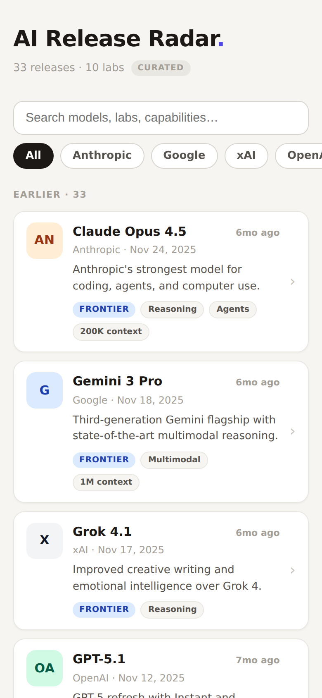

# AI Release Radar

Mobile-first radar for AI model releases across the major labs, plus a daily
top-3 of news stories for your industries. Self-updating — no manual refresh,
no API keys.


## Screenshot



## Project Info

| Item | Details |
|---|---|
| Project Name | release |
| Repo | dariohudon/Release |
| Folder | /var/www/release |
| Domain | release.brightening.ca |
| Port | 3033 |
| PM2 Process | release |
| Tmux Session | release |
| Tmux Launcher | tmux-release |

## What it shows

| Section | Content |
|---|---|
| **Top stories** | Top 3 news articles for your industries (Google News, last 7 days) |
| **Release feed** | AI model releases grouped by recency, filterable by lab, searchable |

Labs tracked: OpenAI, Anthropic, Google, Meta, Mistral, DeepSeek, Qwen, xAI,
Moonshot, Z.ai.

## Data Sources

| Source | Role | Key needed |
|---|---|---|
| Curated timeline (`lib/ai/curated.ts`) | Frontier launches with summaries and links | No |
| Hugging Face public API | Live open-weights drops from each lab's HF org | No |
| Google News RSS | Top stories per industry topic | No |

The curated dataset is the baseline, so the app renders fully even with zero
network access. Live sources are merged on top and degrade silently — the
header badge shows **Live** (green) when Hugging Face responded, **Curated**
otherwise.

## Self-updating

The page uses Next.js ISR with `revalidate = 21600`: every visit after the
6-hour window triggers a background re-render that re-polls Hugging Face and
the news feeds. Nothing to deploy or restart.

If the site can go days without a visitor, add a cron to keep the cache warm:

```cron
0 */12 * * * curl -s http://localhost:3033/ > /dev/null
```

To add a model release manually (e.g. a launch the live sources missed),
append an entry to the top of `lib/ai/curated.ts` and redeploy.

## Environment Variables

Copy `.env.example` to `.env.local`. Everything is optional.

| Variable | Default | Description |
|---|---|---|
| `NEWS_TOPICS` | `artificial intelligence` | Comma-separated industries for Top stories, e.g. `artificial intelligence, creative agencies, e-commerce` |

## Design

Warm paper background, near-black ink, single indigo accent. Design tokens
live in `app/globals.css` (CSS variables); components reference them inline.
Mobile-first single column (max 600px), sticky search + horizontally
scrollable lab filter chips, releases bucketed by This week / This month /
Past 3 months / Earlier. Cards from the past 7 days get an accent highlight.
Every card links out to the announcement, model card, or article.

## API

| Endpoint | Description |
|---|---|
| `GET /api/releases` | Full feed as JSON (releases + top stories + source status) |
| `GET /api/health` | Connectivity to Hugging Face and Google News, configured topics |

## Development

```bash
cd /var/www/release
npm run dev        # dev server on port 3033
npm run build      # production build
npm run type-check # TypeScript check
npm run lint       # ESLint
```

## Production (PM2)

```bash
pm2 start /var/www/release/ecosystem.config.js
pm2 restart release
```

## History

This repo previously hosted Episode Radar (Sonarr + Plex episode tracker);
it was rewritten as AI Release Radar in June 2026. The old implementation is
preserved in git history and `docs/milestones/`.
